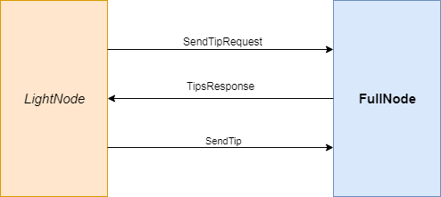

# Blockchain on WSN

### Scopo del progetto: Costruire una Blockchain per memorizzare misurazioni effettuate da mote

##### Alcune definizioni:
Una Blockchain è, letteralmente, una catena di Blocchi legati tra loro mediante l'hash di un blocco precedente.
E' un sistema distribuito tra tutti gli utenti che partecipano alla creazione di nuovi blocchi.

##### Problematiche:
Considerando le notevoli limitazioni hardware dei sensori WSN, si è deciso di porre alcune modifiche all'idea base della blockchain.
La struttura iniziale della blockchain è stata, quindi, rivista e sostituita dal DAG – Direct Acyclic Graph che corrisponde ad un grafo privo di cicli al suo interno e diretto.
La scelta cade alla base dell'algoritmo di consenso scelto per risolvere le limitazioni sui dispositivi utilizzati per l'implementazione.
Spunti per la soluzione al problema sono presenti nel testo[1].
 
### Architettura


Il sistema progettato è attualmente centralizzato per minimizzare l'utilizzo di memoria richiesta sui Mote. Esisterà, dunque, un dispositivo detto FullNode rappresentato da un PC, che manterrà in memoria numerose variabili tra le quali l'intero DAG (BlockChain).

#### FullNode
Il FullNode si occupa delle seguenti operazioni:
 
 - Inizializza il DAG ( vengono istanziati i due blocchi genesi, si tratta dei blocchi iniziali necessari per costruiure il DAG )
 - Alle richieste di creazione di nuovi blocchi da parte dei LightNode risponde inviando gli hash di due tra i blocchi gia' esisitenti.
 
A questo punto, si fa presente che non ci si e' voluti soffermare a fondo nell'implementazione totale del sistema poiche' il progetto nasce a scopo didattico. 
Quindi, si lascia la possibilita' di ulteriori implementazioni, ovvero:

 - ###### ToDo (Ricerca Blocchi piu' recenti)
   Nell'implementazione reale di un DAG, gli hash da inviare devono corrispondere ai blocchi meno utilizzati all'interno del DAG 
   stesso.
 - ###### ToDo (Robustezza del DAG):
   Ciò equivale ad accrescere l'attendibilità dei nuovi blocchi, quelli inseriti più di recente. E' infatti possibile creare
   un blocco con misurazioni (appositamente) inesatte e cercare di inserirlo nella struttura. Viene quindi richiesta la verifica di 
   ciascun blocco, sia nel momento precedente l'aggiunta al DAG, sia in un secondo momento. Quando (l'hash di) un blocco viene 
   usato da molteplici altri blocchi, la sua attendibilità aumenta poiché ritenuto sufficientemente affidabile da poter far parte del DAG.
    
 - ###### ToDo (Verifica blocco):
   Bisogna decifrare il blocco, determinare la correttezza dei dati in esso presenti, aggiornare la tabella di
   credibilità del LightNode e, eventualmente, aggiungere il Blocco al DAG se tutti i controlli sono risultati soddisfacenti.
   Ricevuto il blocco di misurazioni dal LightNode, ne verifica la correttezza.
   Aggiorna la difficoltà da superare per un determinato LightNode in base all'ultimo blocco che questi ha inviato al FullNode.
   
 - ###### ToDo (Credit-Based PoW Mechanism): 
   Aggiornare la difficoltà richiede grande conoscenza dei possibili attacchi alle blockchain, ai DAG, ai mote ed a molte 
   altre variabili presenti nel progetto in questione.
   Un'idea di come poter sviluppare quanto appena descritto la si può trovare a pagina 4, capitolo "B. Credit-Based PoW Mechanism"
   nel paper [1].
   
#### LightNode

Le operazioni che invece vengono svolte dai sensori:

 - Richiesta al FullNode degli hash (prevHash1, prevHash2).
 - Rilevazioni della temperatura (umidita',luce).
 - ###### ToDo (Calcolo dell'hash complessivo di: {moteID, Misurazioni,  prevHash1,  prevHash2, nonce}):
    - Il moteID rappresenta un ID univoco per ogni sensore WSN
    - PrevHash1, PrevHash2 : hash relativi ai blocchi del DAG attaccati per la creazione del nuovo blocco. 
    - Il nonce è un numero intero che provvede alla generazione di nuovi hash.
     Maggiori informazioni sui nonce si possono trovare su [3]
 - Costruzione del nuovo blocco ed invio al FullNode
 
##### ToDo (Sicurezza):
 
Data la complessità nello gestire le chiavi private, pubbliche e conseguente cifratura dei messaggi, tale parte del progetto non è stata sviluppata. I LightNode dispongono di risorse minimali per quanto riguarda la sicurezza; sviluppare un sistema di cifratura leggero sia computazionalmente che temporalmente parlando richiede un attento studio.
Nel paper [1] a pagina 5, si discute di un eventuale implementazione che risolve questa problematica attraverso l'utilizzo di un sistema a chiave simmetrica inizializzata mediante un ulteriore processo di distribuzione basato sul concetto di chiave pubblica e privata gestita direttamente dal FullNode come Certfication Authority.
   
### Implementazione
 
Il sistema appena descritto e' stato implementato sul framework di TinyOS, in particolare e' stato testato per dispositivi quali telosb e XM1000.

NB: per l'XM1000 che non e' supportato dalla versione 2.1.2 e' necessaria una istallazione esterna , vedi 
https://maitreyanaik.wordpress.com/2015/08/26/tinyos-support-for-xm1000-motes/, inoltre si consiglia all'interno della pagina di scaricare il contenuto del link https://github.com/benlammel/Vagrant_TinyOS-2.1.2_msp430-47_XM1000.
A questo punto,senza seguire le istruzioni presenti nel README, copiare il contenuto della cartella tinyos-2.1.2 direttamente nella directory di istallazione del tinyos nel vostro workspace.

Ora, dando uno sguardo a quelle che sono le App preparate in nesC e in Java facendo riferimento all'architettura vista prima.
Troviamo che il LightNode e' composto da un'unica applicazione, mentre il FullNode sara' composto da un'app nativa denominata BaseStation
che funge da ponte tra la trasmissione radio e la serial del PC.
La BaseStation, quindi, comunichera' con un applicazione Java denominata FullNode che sfrutta la BS, e che si tratta di un estensione del MsgReader presente nella sdk java del TinyOS.

<p align="center">
  
</p>
 

### LightNodeApp :
  Per cio' che riguarda l'applicazione NesC relativa al LightNode, all'interno della directory e' presente un file header dove e' possibile definire alcuni parametri per configurare il nodo, questi parametri sono distinti in parametri globali e locali:
La distinzioni per parametri locali e' stata eseguita per permettere di configurare alcuni valori del nodo sulle misurazioni e sull'esecuzione del task makeTip. 
 - DELTA_TIP : definisce il tempo di attesa massimo per l'invio di un nuovo tipo.
 - DELTA_MEASURES : intervallo di tempo tra una rilevazione e l'altra delle temperature.
 E' stato utilizzato, invece, il termine globale per indicare tutti quei parametri che anche il FullNode deve conoscere affinche' LightNodes e FullNode possano comunicare senza ottenere degli errori.
 Percio' e' strettamente necessario che quando vengono modificati questi parametri siano ricompilate entrambe le applicazioni.
 Piu' avanti verra' spiegato come farlo e come e' stato organizzato il makefile.
 A seguire sono elencate le definizioni:
 
 - NUM_MEASURES : numero di misurazioni effettuate da inviare (di default e' stato scelto un numero di 5 misure per problematiche relative alla grandezza max del payload del messaggio poiche di defalult e' imposato fino a 26 byte).
 - LENGTH_HASH : seguendo le linee di implementazione del tinyos e' possibile inviare solo tipi semplici (sono percio' escluse stringhe e char), e' stato scelto percio' di rappresentare un hash come un array di uint8_t.
 Scegliendo una lunghezza di 64 bit sara' necessaria una LENGTH_HASH=8 (default).
 
##### Makefile per FullNode

Come gia' anticipato prima, il processo di compilazione per l'applicazione del FullNode non prevede solamente la compilazione del FullNode.java ma anche di alcune librerie come quelle pertinenti al DAG che troviamo in un cartella apposita e le classi java relative ai messaggi.
Infatti, come verra' spiegato piu' avanti FullNode e LightNode non comunicano attraverso un messaggio specifico ma con piu' messaggi.
E' per tale motivo che esistono piu' classi messaggio e che ogni volta devono essere ricostruite mediante un apposito tool denominato mig che analizza un file contenente delle struct e ritorna una classe java con i metodi necessari alla manipolazione di quella tipologia di messaggi anche in java.

```
LIGHTNODE_H= $(TOSROOT)/apps/BCWSN/LightNode/LightNode.h

OTHER_CLEAN = rmMsg $(wildcard *.java) TipsRequestMsg.java TipsResponseMsg.java SendTipMsg.java

JavacMsg:
	javac *.java

TipsRequestMsg.java:
	mig java -java-classname=MsgClass.TipsRequestMsg $(LIGHTNODE_H) TipsRequestMsg -o TipsRequestMsg.java

TipsResponseMsg.java:
	mig java -java-classname=MsgClass.TipsResponseMsg $(LIGHTNODE_H) TipsResponseMsg -o TipsResponseMsg.java

SendTipMsg.java:
	mig java -java-classname=MsgClass.SendTipMsg $(LIGHTNODE_H) SendTipMsg -o SendTipMsg.java

rmMsg:	
	rm *.java
        

ROOT = ../../../../support/sdk/java

include $(ROOT)/Makefile.include

```

 
 
  
### Struttura dei messaggi:

Il tinyos permette di definire una moltitudine di messaggi a seconda delle esigenze, in questo caso sono stati definiti tre tipologie  messaggi (la tipologia del messaggio viene specificata attraverso l'AM_TYPE) che come si puo' pensare rappresentano una specie di three-way handshake del tcp.
 - LightNode invia un "SendTipRequestMessage" al FullNode
 - FullNode risponde con un "TipResponseMessage" al LightNode.
 - LightNode una volta completata la PoW invia un "SendTipMessage".
 
<p align="center">

</p>
   
### Riferimenti   
[1] - “Towards Secure Industrial IoT: Blockchain System with Credit-Based Consensus Mechanism” a cura di Junqin Huang, Linghe Kong, Senior Member, IEEE, Guihai Chen, Min-You Wu, Xue Liu, Senior Member, IEEE, Peng Zeng.

[2] - Qualcosa sui DAG ai link:
 - Molto buono: <https://www.youtube.com/watch?v=CZxH1V_zoug> 
 - Molto meno buono: <https://www.cryptominando.it/2018/04/02/dag-blockchain/>
 
[3] - <https://en.bitcoin.it/wiki/Nonce>

