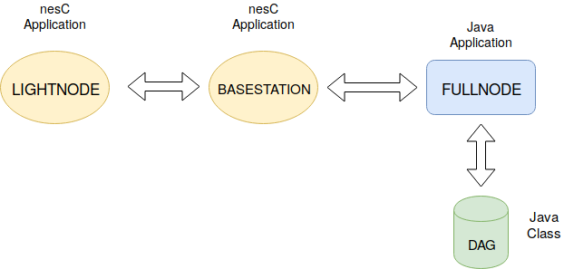

# Blockchain on WSN

### Scopo del progetto: Costruire una Blockchain per memorizzare le misurazioni effettuate dai mote

##### Alcune definizioni:
Una Blockchain è, letteralmente, una catena di Blocchi legati tra loro mediante l'hash di un blocco precedente.
E' un sistema distribuito tra tutti gli utenti che partecipano alla creazione di nuovi blocchi.

##### Problematiche:
Considerando le notevoli limitazioni hardware dei sensori WSN, si è deciso di porre alcune modifiche all'idea base della blockchain.
La struttura iniziale della blockchain è stata, quindi, rivista e sostituita dal DAG – Direct Acyclic Graph che corrisponde ad un grafo privo di cicli al suo interno e diretto.
La scelta cade alla base dell'algoritmo di consenso scelto per risolvere le limitazioni sui dispositivi utilizzati per l'implementazione.
Spunti per la soluzione al problema sono presenti nel testo[1].
 
###Architettura

Il sistema progettato è attualmente centralizzato per minimizzare l'utilizzo di memoria richiesta sui Mote. Esisterà, dunque, un dispositivo detto FullNode rappresentato da un PC, che manterrà in memoria numerose variabili tra le quali l'intero DAG (BlockChain).

#### FullNode
Il FullNode si occupa delle seguenti operazioni:
 
 - Inizializza il DAG ( vengono istanziati i due blocchi genesi, si tratta dei blocchi iniziali necessari per costruiure il DAG )
 - Alle richieste di creazione di nuovi blocchi da parte dei LightNode risponde inviando gli hash di due tra i blocchi gia' esisitenti.
 
A questo punto, si fa presente che non ci si e' voluti soffermare a fondo nell'implementazione totale del sistema poiche' il progetto nasce a scopo didattico. 
Quindi, si lascia la possibilita' di ulteriori implementazioni a seguire:

 - ###### ToDo (Ricerca Blocchi piu' recenti)
   Nell'implementazione reale di un DAG, gli hash da inviare devono corrispondere ai blocchi meno utilizzati all'interno del DAG 
   stesso.
 - ###### ToDo (Credit-Based PoW Mechanism):
   Ciò equivale ad accrescere l'attendibilità dei nuovi blocchi, quelli inseriti più di recente. E' infatti possibile creare
   un blocco con misurazioni (appositamente) inesatte e cercare di inserirlo nella struttura. Viene quindi richiesta la verifica di 
   ciascun blocco, sia nel momento precedente l'aggiunta al DAG, sia in un secondo momento. Quando (l'hash di) un blocco viene 
   usato da            molteplici altri blocchi, la sua attendibilità aumenta poiché ritenuto sufficientemente affidabile da poter far   
   parte del DAG.
    
 - ###### ToDo: Bisogna decifrare il blocco, determinare la correttezza dei dati in esso presenti, aggiornare la tabella di   
   credibilità del LightNode    e, eventualmente, aggiungere il Blocco al DAG se tutti i controlli sono risultati soddisfacenti.
   Ricevuto il blocco di misurazioni dal LightNode, ne verifica la correttezza.
   Aggiorna la difficoltà da superare per un determinato LightNode in base all'ultimo blocco che questi ha inviato al FullNode.
   
 - ###### ToDo: Aggiornare la difficoltà richiede grande conoscenza dei possibili attacchi alle blockchain, ai DAG, ai mote ed a molte 
   altre variabili presenti nel progetto in questione.
   Un'idea di come poter sviluppare quanto appena descritto la si può trovare a pagina 4,    capitolo "B. Credit-Based PoW Mechanism"    
   nel paper [1].
   
### Implementazione
 
Il sistema appena descritto e' stato implementato in parte sul framework di TinyOS.
Riguardo, quindi, ai dispositivi e le applicazioni installate su di essi, avremo che il FullNode funzionera' mediante una normale App
gia' presente in tinyos sotto il nome di "BaseStation" che permette al PC di ricevere i messaggi, elaborarli e rispondere ai LightNode.
Su quest'ultimi, invece, e' presente un App costruita appositamente per il sistema.

#### LightNodeApp
Tale applicazione esegue un particolare task che si occupa di tali operazioni:
Ad inziazione
 - Richiesta al FullNode degli hash (prevHash1, prevHash2)
 - Rilevazioni della temperatura (umidita',luce)
 - ####### ToDo:Calcolo dell'hash complessivo di: {moteID, Misurazioni,  prevHash1,  prevHash2, nonce}. 
   - Il moteID rappresenta un ID univoco per ogni sensore WSN
   - PrevHash1, PrevHash2 : hash relativi ai blocchi del DAG attaccati per la vreazione del nuov blocco. 
   - Il nonce è un numero intero che provvede alla generazione di nuovi hash.
     Maggiori informazioni sui nonce si possono trovare su <https://en.bitcoin.it/wiki/Nonce>
    
 - Cifra le informazioni di sopra in un Blocco e lo manda al FullNode **TODO1

 #### ToDo 1(CIFRATURA) :
    Data la complessità nello gestire le chiavi private, pubbliche e conseguente cifratura dei messaggi, tale parte del progetto non è stata sviluppata. I LightNode dispongono di risorse minimali per quanto riguarda la sicurezza; sviluppare un sistema di cifratura leggero sia computazionalmente che temporalmente parlando richiede un attento studio.
    Nel paper [1] a pagina 5, si discute di un eventuale implementazione che risolve questa problematica attraverso l'utilizzo di un sistema a chiave simmetrica inizializzata mediante un ulteriore processo di distribuzione basato sul concetto di chiave pubblica e privata gestita direttamente dal FullNode come Certfication Authority.  

  

 

### LightNodeApp :
  Sull'utilizzo dell'applicazione NesC relativa al LightNode all'interno della cartella stessa e' presente un file header dove e' possibile definire alcuni parametri per configurare il nodo :
 - DELTA_TIP : definisce il tempo di attesa massimo per l'invio di un nuovo tipo.
 - DELTA_MEASURES : intervallo di tempo tra una rilevazione e l'altra delle temperature.
 - NUM_MEASURES : numero di misurazioni effettuate da inviare (di default e' stato scelto un numero di 5 misure per problematiche relative alla grandezza max del payload del messaggio poiche di defalult e' imposato fino a 26 byte).
 - LENGTH_HASH : seguendo le linee di implementazione del tinyos e' possibile inviare solo tipi semplici (sono percio' escluse stringhe e char), e' stato scelto percio' di rappresentare un hash come un array di uint8_t.
 Scegliendo una lunghezza di 64 bit sara' necessaria una LENGTH_HASH=8 (default).
 
### FullNodeApp :
  Per quanto riguarda il FullNode che essenzialmente nasce come una reimplementazione del MsgReader presente nel sdk java di tinyos,
  esso sostanzialmente, comunica con la base station con lo scopo di ricevere e inviare paccheti seguendo uno schema predefinito.
  
###Struttura dei messaggi:

Il tinyos permette di definire una moltitudine di messaggi a seconda delle esigenze, in questo caso sono stati definiti tre tipologie  messaggi (la tipologia del messaggio viene specificata attraverso l'AM_TYPE) che come si puo' pensare rappresentano una specie di three-way handshake del tcp.
 - LightNode invia un "SendTipRequestMessage" al FullNode
 - FullNode risponde con un "TipResponseMessage" al LightNode.
 - LightNode una volta completata la PoW invia un "SendTipMessage".
 
  

  

   
### Riferimenti   
[1] - “Towards Secure Industrial IoT: Blockchain System with Credit-Based Consensus Mechanism” a cura di Junqin Huang, Linghe Kong, Senior Member, IEEE, Guihai Chen, Min-You Wu, Xue Liu, Senior Member, IEEE, Peng Zeng.

[2] - Qualcosa sui DAG ai link:
 - Molto buono: <https://www.youtube.com/watch?v=CZxH1V_zoug> 
 - Molto meno buono: <https://www.cryptominando.it/2018/04/02/dag-blockchain/>

