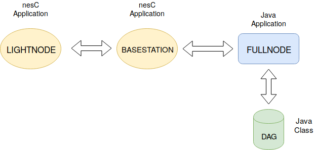
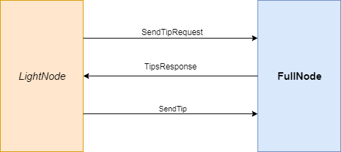
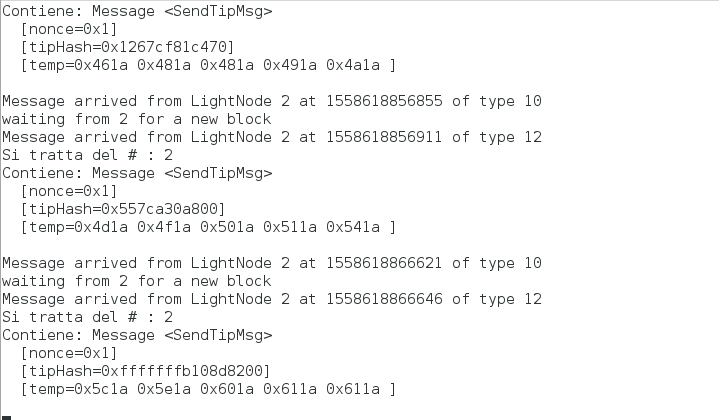

# Blockchain on WSN

### Scopo del progetto
Implementazione di una Blockchain per memorizzare misure effettuate da Wireless Sensors.

##### Alcune definizioni
Una Blockchain è letteralmente una catena di Blocchi legati tra loro mediante l'hash di un blocco precedente.
È un sistema distribuito tra tutti gli utenti che partecipano alla creazione di nuovi blocchi.

##### Problematiche
Considerando le notevoli limitazioni hardware dei sensori WSN, si è deciso di porre alcune modifiche all'idea base della blockchain.
La struttura iniziale della blockchain è stata quindi rivista e sostituita dal DAG (Direct Acyclic Graph) che corrisponde ad un grafo diretto privo di cicli al suo interno per permettere l'inserimento dei blocchi da parte di più nodi allo stesso momento.
Un'altra scelta, invece, cade alla base dell'algoritmo di consenso in quanto, se normalmente in una blockchain l'impiego del PoW ha sempre potuto risolvere ogni problema, per i dispositivi in nostro possesso se ne sarebbe creato uno.
È così che, invece, è stato scelto di ottimizzare il PoW stesso con un meccanismo Credit-Based PoW.

Spunti per questa soluzione sono presenti nel'articolo [1].
 
### Architettura

Il sistema progettato è attualmente centralizzato data la scarsa disponibilità di memoria sui Mote. Esisterà, dunque, un dispositivo differente dagli altri detto FullNode (nel nostro caso un PC), che sarà il cervello dell'intero sistema.
Il DAG ("tangle") di blocchi (o anche definiti come "tip") è la struttura dati su cui si poggerà il FullNode per memorizzare le informazioni ottenuti dai nodi.

Segue la definizioni dei task eseguiti sui singoli nodi:

#### FullNode

 - Inizializza il DAG (vengono istanziati i due blocchi genesi, cioè i blocchi iniziali necessari per costruiure il DAG)
 - Alle richieste di creazione di nuovi blocchi da parte dei LightNode risponde inviando gli hash di due tra i blocchi già esisitenti
 
A questo punto, si fa presente che non ci si è voluti soffermare a fondo nell'implementazione totale del sistema poiché il progetto nasce a scopo didattico.
Quindi, si lascia la possibilità di ulteriori implementazioni, che sono elementi essenziali al funzionamento completo:

 - ###### Verifica blocco (ToDo):
   Bisogna decifrare il blocco, determinare la correttezza dei dati in esso presenti, aggiornare la tabella di
   credibilità del LightNode ed, eventualmente, aggiungere il Blocco al DAG se tutti i controlli sono risultati soddisfacenti.
   
  - ###### Credit-Based PoW Mechanism (ToDo):
   Sulla base di voler assegnare una difficoltà maggiore o minore a seconda del comportamento del nodo (in modo da evitare elementi malevoli nel gruppo dei LightNode) sarebbe doveroso implementare un algoritmo che segue delle regole particolari per l'assegnazione. Un'idea di come poter sviluppare quanto appena descritto la si può trovare a pagina 4, capitolo "B. Credit-Based PoW Mechanism" nel paper [1].

 - ###### Ricerca blocchi più recenti (ToDo):
   Nell'implementazione reale di un DAG, gli hash da inviare devono corrispondere ai blocchi meno utilizzati all'interno del DAG 
   stesso.
   Ciò equivale ad accrescere l'attendibilità dei nuovi blocchi, quelli inseriti più di recente. Quando l'hash di un blocco viene 
   usato da molteplici altri blocchi, la sua attendibilità aumenta poiché ritenuto sufficientemente affidabile da poter far parte del DAG.
    
   
#### LightNode

 - Richiesta al FullNode degli hash (prevHash1, prevHash2)
 - Rilevazioni della temperatura (umidità, luce)
 
 - Calcolo dell'hash complessivo di {moteID, Misurazioni,  prevHash1,  prevHash2, nonce}:
    - Il moteID rappresenta un ID univoco per ogni sensore WSN
    - PrevHash1, PrevHash2 rappresentano hash relativi ai blocchi del DAG attaccati per la creazione del nuovo blocco
    - Il nonce è un numero intero che provvede alla generazione di nuovi hash. Maggiori informazioni sui nonce si possono trovare in [3]
 - Costruzione del nuovo blocco ed invio al FullNode
 - ###### Warning compilazione (ToDo):
   Nell'implementazione il file LightNodeApp.nc contiene le seguenti linee:
	```
	components new SensirionSht11C() as TempHumSensor;
	//components new HamamatsuS10871TsrC() as LightSensor;
	//components new VoltageC() as Battery;
	```
  
   dove viene chiaramente espresso l'istanziazione dei componenti adibiti a seconda del caso alle misurazioni.
   A tal riguardo sarebbe più utile poter sfruttare direttamente un'interfaccia (che però non risulta implementata per la classe di dispositivi utilizzati in fase di test).
 - ###### Flessibilità degli hash (ToDo):
   Per ragioni relative alle tempistiche di implementazione nei codici rilasciati non è possibile definire una lunghezza fissa degli hash,
   quindi nel caso si volessero utilizzare hash più piccoli o più grandi si dovrebbe ricorrere all'utilizzo di array.
  
###### Sicurezza del sistema (General ToDo)
 
Data la complessità nello gestire le chiavi private, pubbliche e conseguente cifratura dei messaggi, tale parte del progetto non è stata sviluppata. I LightNode dispongono di risorse minimali per quanto riguarda la sicurezza.
Sviluppare un sistema di cifratura leggero da applicare per lo scambio di informazioni richiede un attento studio.
Nel paper [1] a pagina 5, si discute di un eventuale implementazione che risolve questa problematica attraverso l'utilizzo di un sistema a chiave simmetrica inizializzata mediante un ulteriore processo di distribuzione basato sul concetto di chiave pubblica e privata gestita direttamente dal FullNode come Certfication Authority.
   
### Implementation
 
Il sistema appena descritto è stato implementato sul framework TinyOS, in particolare è stato testato per dispositivi quali telosb e XM1000.

Nota: per l'XM1000 che non è supportato dalla versione 2.1.2 è necessaria un'istallazione esterna, vedi 
https://maitreyanaik.wordpress.com/2015/08/26/tinyos-support-for-xm1000-motes/, inoltre si consiglia, all'interno della pagina, di scaricare il contenuto del link https://github.com/benlammel/Vagrant_TinyOS-2.1.2_msp430-47_XM1000.
A questo punto, senza seguire le istruzioni presenti nel README, copiare il contenuto della cartella tinyos-2.1.2 direttamente nella directory di istallazione del tinyos nel vostro workspace.

Ora, dando uno sguardo a quelle che sono le App preparate in nesC e in Java e facendo riferimento all'architettura vista prima,
troviamo che il LightNode è composto da un'unica applicazione, mentre il FullNode sarà composto da un'app nativa denominata BaseStation (BS in breve) installata sul mote che funge da ponte tra la trasmissione radio e la serial del PC.
La BaseStation, quindi, comunicherà con un'applicazione Java denominata FullNode che sfrutta la BS estendendo il MsgReader presente nella sdk java del TinyOS.

<p align="center">
  
</p>
 

### LightNodeApp

  Perciò che riguarda l'applicazione NesC relativa al LightNode, all'interno della directory è presente un file header dove è possibile definire alcuni parametri per configurare il nodo. Questi parametri sono distinti in parametri globali e locali:
La distinzioni per parametri locali è stata eseguita per permettere di configurare alcuni valori del nodo sulle misurazioni e sull'esecuzione del task makeTip. 
 - DELTA_TIP (Local): definisce il tempo di attesa massimo per l'invio di un nuovo tipo
 - DELTA_MEASURES (Local): intervallo di tempo tra una rilevazione e l'altra delle temperature.
 
 È stato utilizzato, invece, il termine globale per indicare tutti quei parametri che anche il FullNode deve conoscere affinché LightNodes e FullNode possano comunicare senza ottenere degli errori.
 Perciò è strettamente necessario che quando vengono modificati questi parametri siano ricompilate entrambe le applicazioni.
 Più avanti verrà spiegato come farlo e come è stato organizzato il makefile.
 A seguire è elencata la definizione:
 
 - NUM_MEASURES (Global): numero di misurazioni effettuate da inviare (di default è stato scelto un numero di 5 misure per problematiche relative alla grandezza max del payload del messaggio poiche di defalult è impostato fino a 26 byte).
 
##### Makefile per FullNode

Come già anticipato prima, il processo di compilazione per l'applicazione del FullNode non prevede solamente la compilazione del FullNode.java ma anche di alcune librerie come quelle pertinenti al DAG che troviamo in un cartella apposita e le classi java relative ai messaggi.
Infatti, come verrà spiegato più avanti, FullNode e LightNode non comunicano attraverso un messaggio specifico ma con più messaggi.
È per tale motivo che esistono più classi messaggio che ogni volta devono essere ricostruite mediante un apposito tool denominato mig che analizza il file LightNode.h contenente delle nx_struct (struct appositamente create per la definzione del payload pertinente agli ActiveMessage, vedi manuale TinyOS). Questo ritorna una classe java con i metodi necessari alla sua manipolazione.

```
LIGHTNODE_H= $(TOSROOT)/apps/BCWSN/LightNode/LightNode.h

OTHER_CLEAN = rmMsg $(wildcard *.java) TipsRequestMsg.java TipsResponseMsg.java SendTipMsg.java

JavacMsg:
	javac *.java

TipsRequestMsg.java:
	mig java -java-classname=MsgClass.TipsRequestMsg $(LIGHTNODE_H) TipsRequestMsg -o TipsRequestMsg.java

TipsResponseMsg.java:
	mig java -java-classname=MsgClass.TipsResponseMsg $(LIGHTNODE_H) TipsResponseMsg -o TipsResponseMsg.java

SendTipMsg.java:
	mig java -java-classname=MsgClass.SendTipMsg $(LIGHTNODE_H) SendTipMsg -o SendTipMsg.java

rmMsg:	
	rm *.java
        

ROOT = ../../../../support/sdk/java

include $(ROOT)/Makefile.include

```
In breve, viene definito il path al LightNode.h e, differentemente dalla norma, attraverso il comando make clean verranno cancellati i file java. Le istruzioni relative all'esecuzione di mig relativi ai messaggi, verranno chiamate appena dopo il clean.

Nota: l'inserimento di "MsgClass" dopo -java-classname per specificare la definizione del package.
 
Riguardo al makefile per il LightNode non ci sono informazioni rilevanti da riportare. 
  
### Comunicazione tra le App

<p align="center">

</p>

Il tinyos permette di definire una moltitudine di messaggi a seconda delle esigenze, in questo caso sono state definite tre tipologie di  messaggi (specificata attraverso l'AM_TYPE) che come si può pensare, rappresentano una specie di three-way handshake del TCP:
 - LightNode invia un "SendTipRequestMessage" al FullNode
 - FullNode risponde con un "TipResponseMessage" al LightNode
 - LightNode una volta completata la PoW invia un "SendTipMessage"
 
Nota: Rispetto al LightNode, il FullNode non esegue un ACK del messaggio, quindi un messaggio per qualche motivo non consegnato al LightNode non verrà mai reinviato dal FullNode. Diverso il discorso per il LightNode che, invece, rimane in attesa di una risposta.

Inoltre, facciamo presente che il LightNode, invia ogni TipRequest in broadcast e, successivamente alla risposta da parte del FullNode e conseguente conoscenza del suo ID, inserisce la destinazione corretta nel SendTipMessage (inviato in unicast).

### Istruzioni sull'uso

I codici presenti nella repository hanno una grande dipendenza dai makerule e dagli sdk del tinyos, perciò dovranno rispettare 
uno specifico path per poter essere buildati, installati ed eseguiti (caso del FullNode).
Per prima cosa è necessario cambiare directory e posizionarsi all'interno della cartella apps del tinyos e poi eseguire il git clone.
```
tinyos@debian:~/tinyos-main/apps$ git clone https://github.com/andy93-16/BCWSN
```
Il passo successivo sta nell'installare la LightNodeApp su un mote e per fare ciò è necessario spostarsi all'interno della directory LightNode ed eseguire il seguente comando:
```
tinyos@debian:~/tinyos-main/apps/BCWSN/LightNode$ make "modellomote" install."idchesivuoleassegnare",/dev/ttyUSBx

# Esempio telosb
tinyos@debian:~/tinyos-main/apps/BCWSN/LightNode$ make telosb install.y bsl,/dev/ttyUSBx
```

Per quanto riguarda il FullNode, è necessario installare su un altro nodo l'app BaseStation (che è nativa nel framework)
seguendo i comandi:
```
tinyos@debian:~/tinyos-main/apps/BaseStation$ make "modellomote" install."idchesivuoleassegnare",/dev/ttyUSBx

# Esempio telosb
tinyos@debian:~/tinyos-main/apps/BaseStation$ make telosb install.y bsl,/dev/ttyUSBx
```

Dopo aver fatto ciò, per inizializzare il FullNode bisogna spostarsi nella directory FullNode ed eseguire:
```
tinyos@debian:~/tinyos-main/apps/BCWSN/FullNode$ "package" FullNode -comm serial@/dev/ttyUSBx:"baudrate"

# Esempio telosb
tinyos@debian:~/tinyos-main/apps/BCWSN/FullNode$ java FullNode -comm serial@/dev/ttyUSBx:telosb
```

Arrivati a questo punto si dovrebbe avere una situazione simile a quella in foto:
<p align="center">

</p>
dove è visibilmente chiaro che il nostro sistema è composto da un LightNode che comunica sequenzialmente con il FullNode.
Il FullNode dice di aver ricevuto un TipRequestMessage, il FullNode si mette in attesa di una SendTipMessage e la riceve con conseguente stampa.

Nota: I comandi eseguiti precedentemente sono terminali Linux, per terminali Windows consultare il manuale.
   
### Riferimenti   
[1] “Towards Secure Industrial IoT: Blockchain System with Credit-Based Consensus Mechanism” a cura di Junqin Huang, Linghe Kong, Senior Member, IEEE, Guihai Chen, Min-You Wu, Xue Liu, Senior Member, IEEE, Peng Zeng.

[2] Approfondimenti sul DAG:
 - <https://www.youtube.com/watch?v=CZxH1V_zoug> 
 - <https://www.cryptominando.it/2018/04/02/dag-blockchain/>
 
[3] Approfondimento sul Nonce:
- <https://en.bitcoin.it/wiki/Nonce>

